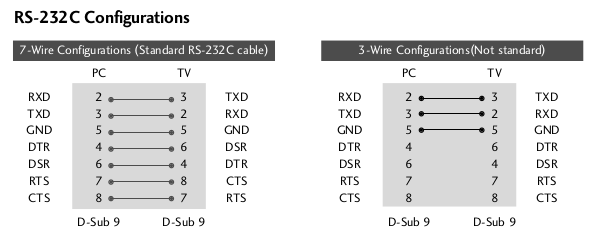

lg_control
==========

Sends control codes to a connected LG TV.  There are other programs that 
do something similar to this, but I wanted something fairly generic, that
played nicely with USB-serial port adapters.

Hardware Setup
==============

Prior to the days of HDMI-CEC (or whatever your favoured manufacturer 
[wants to call it](https://www.howtogeek.com/207186/how-to-enable-hdmi-cec-on-your-tv-and-why-you-should/)) 
many LG TVs came equipped with an RS232 port
over which could be sent control commands.  If the back of your LG set looks
something like this then you have one:


See the 'D' connector labelled RS-232C IN (CONTROL & SERVICE).

If you then seek out the PDF (or physical) manual for your TV (in my case
32LH2000.pdf), then the Appendix talks about this connector:


If you don't have a proper null modem cable (I did) you can just make up a
simple 3-way cross-over cable.  It seems the flow-control lines aren't used.



It also tells you what baud rate to use and the command codes accepted. 
It's all pretty standard, 9600 baud 8 data bits, 1 stop bit no parity.  If
you know anything about RS-232 you probably would have tried that first
anyway.

Command Protocol
================

The manual describes how commands are sent:


Codes sent to the TV consist of two command letters, followed by a space
followed by the set ID, another space some data and then a newline.

The lg_command program takes serial device as the first argument, then
groups the two command characters together as the
second, the set ID as the third, and the data as the fourth. 

For example for power-on for any connected set the code would be:

```
ka 00 01<newline>
```

lg_control accepts this as:

```
./lg_control /dev/ttyS0 ka 00 01
```

In other words the first argument is the serial device, the second the
two-character control code combination, the third the set ID and the final
the two-character hexadecimal data value. lg_control converts the gaps
between the arguments to spaces, clearly if you put more than one
consecutive space it still sends just a single space on the serial line
which is generally what you want.

There is no checking of the validity of the command before sending it to the
set.  After the command has been sent the program waits for a short delay
before printing any returned data and exiting.  This is important for things
like obtaining the volume level before increasing/decreasing it if that's
the control you want, since there's no way to tell an LG set to increase the
volume by n% the current value must be queried.  It's the same with
brightness, contrast and so on.

After transmitting a command lg_control waits 5 seconds for a response. 
This value was found by experimentation, issuing different commands to a TV. 
All responses fell well within that time.  If a valid response code is
received sooner, then the wait is aborted.

A typical response to the power on command would be:

```
a 01 OK01x
```

The 'a' is the second command-byte (the first command-byte isn't returned to
the sender for some reason), the 01 is the set ID that responded to the
command, the OK indicates success, the 01 indicates the current status if a
value was written (in this case 'on'), the x terminates the response.
